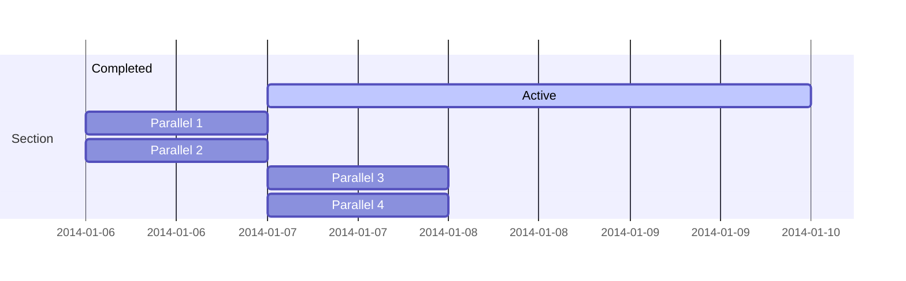

The FireANTs library is a lightweight registration package for Riemannian diffeomorphic registration on GPUs.

## Core Idea

The initial motivations were to create a GPU reimplementation of the widely used [ANTs](https://github.com/ANTsX/ANTs) library. 

However, we improved upon the initial implementation to implement first-order adaptive algorithms (like Adam) on Riemannian manifolds, specifically for multi-scale diffeomorphisms.


```markmap {height="200px"}
- 🔥 FireANTs
  - Moment matching 
    - Center of mass
    - moment tensor matching
  - Rigid
  - Affine
  - Deformable
    - Greedy (not symmetric)
    - SyN (symmetric)
```

## Diagrams

Hugo Blox supports the _Mermaid_ Markdown extension for diagrams.

An example **Gantt diagram**:

    ```mermaid
    gantt
    section Section
    Completed :done,    des1, 2014-01-06,2014-01-08
    Active        :active,  des2, 2014-01-07, 3d
    Parallel 1   :         des3, after des1, 1d
    Parallel 2   :         des4, after des1, 1d
    Parallel 3   :         des5, after des3, 1d
    Parallel 4   :         des6, after des4, 1d
    ```

renders as



## Todo lists

You can even write your todo lists in Markdown too:

```markdown
- [x] Write math example
  - [x] Write diagram example
- [ ] Do something else
```

renders as

- [x] Write math example
  - [x] Write diagram example
- [ ] Do something else

## Did you find this page helpful? Consider sharing it 🙌
