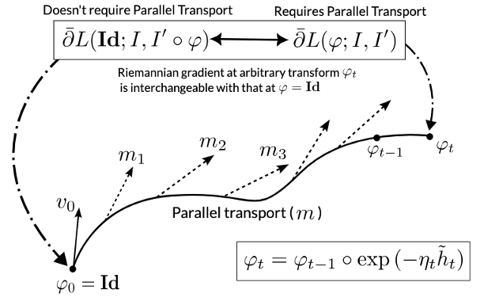

The FireANTs library is a lightweight registration package for Riemannian diffeomorphic registration on GPUs.

## Features

Currently, FireANTs supports the following forms of registration:


Moreover, it supports the following similarity metrics:
- Cross-correlation
- Mutual information
- Mean squared error
- Custom similarity metrics (see [Tutorial](https://github.com/rohitrango/FireANTs/blob/fireants/tutorials/%5BTutorial%202%5D%20Custom%20loss%20functions.ipynb))

FireANTs also provides functionality for saving transformations in the ANTs formats for seamless integration with existing workflows.

We also provide scripts for template building.

## Core Idea

The initial motivations were to create a GPU reimplementation of the widely used [ANTs](https://github.com/ANTsX/ANTs) library. 
However, we improved upon the initial implementation to implement first-order adaptive algorithms (like Adam) on Riemannian manifolds, specifically for multi-scale diffeomorphisms.



<!-- You can use this markmap directly but it has some scrolling issue, I just screenshotted it into an image -->
<!-- ```markmap {height="200px"}
- 🔥 FireANTs
  - Moment matching 
    - Center of mass
    - moment tensor matching
  - Rigid
  - Affine
  - Deformable
    - Greedy (not symmetric)
    - SyN (symmetric)
``` -->

## Installation 

Follow the instructions on the [GitHub page](https://github.com/rohitrango/FireANTs) . 

### Documentation

Coming soon.

## Support and Contributions

Feel free to [add issues](https://github.com/rohitrango/fireants/issues/new) or [pull requests](https://github.com/rohitrango/fireants/compare) to the repository. We welcome contributions to the package.